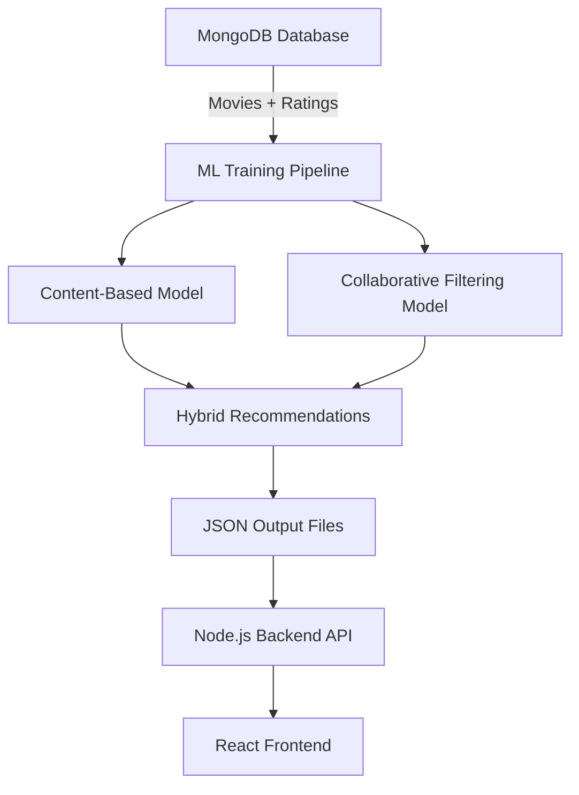

# ML Pipeline Guide

This guide explains how the machine learning recommendation pipeline works, how to use it, and how to maintain it.

## Overview

The ML pipeline consists of three recommendation algorithms that work together to provide personalized movie recommendations:



## Recommendation Algorithms

### 1. Content-Based Filtering (TF-IDF)

**How it works:**
- Analyzes movie metadata (title, overview, genres)
- Creates TF-IDF (Term Frequency-Inverse Document Frequency) vectors
- Computes cosine similarity between movies
- Recommends movies with similar content

**Best for:**
- Finding movies similar to a specific movie
- Cold start problem (new users with no ratings)
- Genre-based recommendations

**Output:** `backend/data/content_based.json`
```json
{
  "1": [245, 389, 672, ...],  // Movie ID 1 → Similar movie IDs
  "2": [112, 445, 891, ...],
  ...
}
```

### 2. Collaborative Filtering (SVD)

**How it works:**
- Analyzes user rating patterns
- Uses Singular Value Decomposition (SVD) to find latent factors
- Predicts how a user would rate unseen movies
- Recommends highly-predicted movies

**Best for:**
- Personalized recommendations based on user behavior
- Discovering movies outside user's usual genres
- "Users who liked X also liked Y"

**Output:** Part of `backend/data/user_recommendations.json`
```json
{
  "user_123": {
    "collaborative": [456, 789, 234, ...],
    ...
  }
}
```

### 3. Hybrid Recommendations

**How it works:**
- Combines content-based and collaborative filtering
- Weights: 60% content-based, 40% collaborative (configurable)
- Takes top collaborative recommendations
- Expands with content-similar movies
- Provides balanced, diverse recommendations

**Best for:**
- Most use cases (default recommendation)
- Balancing personalization with content similarity
- Mitigating weaknesses of individual algorithms

**Output:** Part of `backend/data/user_recommendations.json`
```json
{
  "user_123": {
    "hybrid": [123, 456, 789, ...],
    "collaborative": [...],
    "content": [...]
  }
}
```

## Training the Models

### Full Pipeline

Run the complete training pipeline:

```bash
cd "c:\ML Project\ML"
python train_models.py
```

This executes all three algorithms in sequence and takes approximately 20-60 seconds depending on dataset size.

### Individual Algorithms

You can also train algorithms separately:

```bash
# Content-based only
python -c "from content_based import run; run()"

# Collaborative filtering only
python -c "from collaborative_svd import run; run()"

# Hybrid only (requires content-based and collaborative to be trained first)
python -c "from hybrid import run; run()"
```

## Configuration

Edit `ML/config.py` to customize the pipeline:

### MongoDB Settings
```python
MONGO_URI = "mongodb://localhost:27017/"
DB_NAME = "movie_recommendation"
```

### Algorithm Parameters
```python
# Content-Based
TOP_N_SIMILAR = 20          # Number of similar movies per movie

# Collaborative Filtering
N_FACTORS = 50              # SVD latent factors (higher = more accurate but slower)
TOP_N_USER = 20             # Recommendations per user
MAX_USERS_TO_SAVE = 10000   # Limit users in output (memory optimization)

# Hybrid
CONTENT_WEIGHT = 0.6        # Content-based weight (0-1)
COLLAB_WEIGHT = 0.4         # Collaborative weight (0-1)
TOP_N_COLLAB_SEEDS = 8      # Top collaborative items to use as seeds
TOP_N_CONTENT_PER_SEED = 12 # Content-similar items per seed
```

### Output Paths
```python
OUT_CONTENT_BASED = os.path.join(BACKEND_DIR, 'content_based.json')
OUT_USER_RECS = os.path.join(BACKEND_DIR, 'user_recommendations.json')
```

## Adding New Movies

When you add new movies to your database:

1. **Import to MongoDB:**
   ```bash
   cd "c:\ML Project\backend"
   node scripts/mongodb_import.js
   ```

2. **Retrain models:**
   ```bash
   cd "c:\ML Project\ML"
   python train_models.py
   ```

3. **Restart backend** (or implement hot-reload):
   ```bash
   cd "c:\ML Project\backend"
   npm start
   ```

## Adding New Ratings

When users rate movies (future feature):

1. **Save ratings to MongoDB** (implement in backend)
2. **Retrain collaborative and hybrid models:**
   ```bash
   python -c "from collaborative_svd import run; run()"
   python -c "from hybrid import run; run()"
   ```
3. **Restart backend**

## Automation

### Windows Task Scheduler

Create a batch script `ML/retrain_weekly.bat`:

```batch
@echo off
cd /d "c:\ML Project\ML"
python train_models.py
if %ERRORLEVEL% EQU 0 (
    echo Training completed successfully
) else (
    echo Training failed with error %ERRORLEVEL%
)
```

Schedule it in Task Scheduler to run weekly.

### Linux/Mac Cron Job

Add to crontab (`crontab -e`):

```bash
# Retrain models every Sunday at 2 AM
0 2 * * 0 cd /path/to/ML && python train_models.py >> /var/log/ml_training.log 2>&1
```

## Monitoring & Maintenance

### Check Data Freshness

The backend provides an ML status endpoint (if implemented):

```bash
curl http://localhost:3001/api/ml/status
```

Response:
```json
{
  "content_based": {
    "lastModified": "2026-02-11T16:00:00Z",
    "movieCount": 5000
  },
  "user_recommendations": {
    "lastModified": "2026-02-11T16:00:30Z",
    "userCount": 1000
  }
}
```

### Performance Metrics

Monitor these metrics to ensure quality:

- **Coverage**: % of movies with recommendations
- **Diversity**: Average genre diversity in recommendations
- **Freshness**: Time since last training
- **Response time**: API latency for recommendations

### When to Retrain

Retrain models when:
- ✅ New movies added (content-based needs update)
- ✅ New ratings collected (collaborative needs update)
- ✅ Weekly/monthly schedule (keep recommendations fresh)
- ✅ Algorithm parameters changed
- ❌ Don't retrain too frequently (waste of resources)

## Troubleshooting

### Recommendations seem repetitive

**Cause**: Not enough diversity in training data or algorithm parameters

**Solutions**:
- Increase `TOP_N_SIMILAR` to get more variety
- Adjust `CONTENT_WEIGHT` vs `COLLAB_WEIGHT` in hybrid
- Check if movie metadata has enough variety (genres, descriptions)

### Collaborative filtering not working

**Cause**: Not enough rating data

**Solutions**:
- Need at least 100+ users with 10+ ratings each for good results
- Use content-based or hybrid as fallback
- Reduce `N_FACTORS` if dataset is small

### Training takes too long

**Cause**: Large dataset or high parameter values

**Solutions**:
- Reduce `N_FACTORS` (try 20 instead of 50)
- Reduce `MAX_USERS_TO_SAVE`
- Use incremental training (advanced)
- Run training on a more powerful machine

### Memory errors

**Cause**: Dataset too large for available RAM

**Solutions**:
- Reduce `N_FACTORS`
- Process users in batches
- Use sparse matrix operations (already implemented)
- Increase system RAM

## API Integration

### Frontend Usage

The React frontend uses these algorithms via the API:

```javascript
// Content-based (TF-IDF, Cosine)
api.getRecommendationsByAlgorithm(movieId, 10, 'tfidf');
api.getRecommendationsByAlgorithm(movieId, 10, 'cosine');

// Collaborative (SVD)
api.getRecommendationsByAlgorithm(movieId, 10, 'svd');

// Hybrid
api.getRecommendationsByAlgorithm(movieId, 10, 'hybrid');
```

### Backend Endpoints

```
GET /api/recommendations/content-based/:movieId?limit=10
GET /api/recommendations/user/:userId?type=hybrid&limit=20
```

## Best Practices

1. **Regular Retraining**: Schedule weekly or monthly retraining
2. **Monitor Performance**: Track recommendation quality metrics
3. **Version Control**: Keep model files in version control (Git LFS)
4. **Backup Data**: Backup MongoDB before major changes
5. **Test Before Deploy**: Validate recommendations after retraining
6. **Log Everything**: Keep logs of training runs for debugging

## Advanced Topics

### Incremental Training

For large datasets, implement incremental updates instead of full retraining:

- Content-based: Update only new movies
- Collaborative: Use online learning algorithms
- Hybrid: Combine incremental updates

### A/B Testing

Test different algorithm configurations:

1. Train models with different parameters
2. Serve different recommendations to user groups
3. Measure engagement metrics
4. Deploy best-performing configuration

### Real-time Recommendations

For real-time updates without retraining:

1. Cache pre-computed recommendations
2. Use online learning for new ratings
3. Implement hot-reload of JSON files in backend
4. Use Redis for fast recommendation lookup

## Further Reading

- [TF-IDF Explained](https://en.wikipedia.org/wiki/Tf%E2%80%93idf)
- [Collaborative Filtering](https://en.wikipedia.org/wiki/Collaborative_filtering)
- [SVD for Recommender Systems](https://en.wikipedia.org/wiki/Singular_value_decomposition)
- [Hybrid Recommendation Systems](https://en.wikipedia.org/wiki/Recommender_system#Hybrid_recommender_systems)
